# Search Animals

 ## Sections
- [Purpose](#purpose)
- [Objectives](#objectives)
- [Project Starts](#project-starts)
- [Architecture](#architecture)
- [Cypress Testing](#cypress-testing)
- [CI/CD (Continuous Integration / Continuous Deployment)](#ci-cd-continuous-integration-continuous-deployment)
- [Code Formatting and Linting](#code-formatting-and-linting)
- [Conventional Commits](#conventional-commits)
- [Access The Application](#acess-the-application)
- [Provide at least one test validating some use cases](#test-cases)
- [What Would I Have Done Differently with More Time?](#what-would-i-have-done-differently-with-more-time)
- [Screenshots](#screenshots)
- [License](#license)


## Purpose
The purpose of this test is to validate your technical and organizational skills. It's not a big deal if you can't finish it; we prefer to have a clean and functional incomplete code than badly organized and "ugly" code. You can use any framework (preferably React) or external resources you need, or even vanilla JS. However, don't forget that the goal is to show us your competencies. All styling has to be done without any external UI library.

## Objectives
- Build this application as a production-grade code.
- Focus on replicating the given screenshots/design.
- Provide at least one test validating some use cases.
- What would you have done differently if you had more time? Why?

## Project starts

To install the dependencies, run the following command:
```bash
npm install
```

###  Running in Development
```bash
npm run dev
```

Runs the app in the development mode.\
Open [http://localhost:3000](http://localhost:3000) to view it in the browser.

The page will reload if you make edits.\
You will also see any lint errors in the console.

### Running in Local Production
To build a local production version and run it, use the following commands:
```bash
npm run build && node server.js
```


## Architecture

The project's architecture follows a model that aims to keep responsibilities separate, promoting good organization and maintainability of the code. The structure is based on the MVVM (Model-View-ViewModel) architecture pattern, where each part plays a specific role.

Here is a detailed explanation of each layer of the project:

### UI Layer
The User Interface (UI) layer is responsible for receiving data from the application layer and displaying it on the screens. It contains:
- **PAGES**: Subfolders containing the application's screens.
- **COMPONENTS**: Reusable components.
- **THEME**: Application theme configuration.
- **ASSETS**: Static files such as images and fonts.

### APP Layer
The application layer is responsible for handling the information that enters the application and making it available to the UI part. It includes:
- Configuration of services, routes, and other necessary settings.
- **Hooks and Contexts**: Globally shared functionalities like global states (stores), contexts, and custom hooks.
- **Adapters**: Adapting data from the data layer to the UI.
- **Utils**: Various utilities used in the application.

### Data Layer
The data layer is responsible for providing the information necessary for the application to function. It may involve obtaining data from APIs, databases, or any other data source. It includes:
- **API Services**: Interaction with APIs to obtain data.
- **Data Models**: Data models to represent the application's information.

### Testing (Cypress)
The `cypress` folder contains tests for the application. The tests are written using the Cypress testing tool to validate the application's functionality.

This architecture allows for a clear separation of responsibilities, facilitating project maintenance and scalability, and promoting good development practices such as code reuse and testability.

## Cypress Testing

Cypress was chosen as the testing tool for this project due to its ease of use and suitability for the application context. It provides a straightforward way to conduct both unit and end-to-end (E2E) testing.

### Unit Testing
Cypress allows for efficient unit testing of components within the application. It enables the testing of individual components in isolation, ensuring their functionality behaves as expected.

### End-to-End (E2E) Testing
Cypress excels in end-to-end (E2E) testing, allowing for comprehensive testing of the application as a whole. E2E testing ensures that all components, modules, and integrations function seamlessly together, mimicking a real user's interactions.

### Visual Feedback
One significant advantage of using Cypress is the visual feedback it provides. It generates a clear and visual representation of each component and its behaviors during the testing process. This visual insight aids in identifying any unexpected behaviors, making debugging and issue resolution more efficient.

By utilizing Cypress for testing, the development team can ensure the application's robustness, functionality, and user experience, ultimately leading to a more reliable and high-quality product.

### Cypress Testing Commands

To test the application via the command line, the following commands can be used for different types of testing:

#### Component Testing
To run component tests:
```bash
npm run test
```
To run end-to-end (E2E) tests:
```bash
npm run test-e2e
```
## CI/CD (Continuous Integration / Continuous Deployment)

The application follows a CI/CD approach, utilizing GitHub Actions to enforce a seamless development workflow and automated deployments.

### Continuous Integration (CI)
GitHub Actions are configured to enable continuous integration (CI). Whenever a pull request is created or updated, automated tests are triggered. The pull request cannot be merged unless all tests pass successfully. This ensures that new code is thoroughly tested before being integrated into the main codebase.

### Continuous Deployment (CD)
Upon successful passing of the tests and the approval of the pull request, the next step is to finalize the merge. Once the merge is completed, the application is automatically deployed to Heroku.

### Deployment Process
1. **Merge Approval**: After passing tests and approval, the pull request is merged into the main branch.

2. **Automated Deployment**: The automated deployment process is initiated upon the merge. The new version of the application is automatically deployed to Heroku.

## Code Formatting and Linting

In this project, we maintain consistent code style and formatting using linting and formatting tools, namely ESLint and Prettier. These tools help ensure clean and uniform code across the entire codebase, promoting code maintainability and readability.

### ESLint

[ESLint](https://eslint.org/) is a widely-used linting tool that helps identify and fix problems in JavaScript code. It enforces coding standards and best practices, ensuring code quality and consistency within the project.

### Prettier

[Prettier](https://prettier.io/) is an opinionated code formatter that enforces a consistent code style across the project. It automatically formats code to a standardized style, eliminating debates over code formatting and saving time during code reviews.

## Integration

We've integrated ESLint and Prettier into our development workflow to maintain a high standard of code quality and consistency. The integration is typically achieved through configuration files, such as `.eslintrc` for ESLint rules and `.prettierrc` for Prettier configuration.

### Running Linting and Formatting

To lint and format your code, you can use the following commands:

```bash
# Run ESLint (linting)
npm run lint

# Run Prettier (formatting)
npm run format


## Conventional Commits

This project follows the Conventional Commits standard for commit messages. Conventional Commits is a lightweight convention on top of commit messages, aiming for better readability and enabling automatic versioning and changelog generation.

### Commit Message Structure

A conventional commit message follows this structure:

- **Type**: Describes the purpose of the commit (e.g., feat, fix, chore, docs, style).
- **Scope**: Indicates the part of the project affected by the commit (optional).
- **Message**: A short, descriptive message of the changes.

### Examples

- **feat: add new search functionality**
  Adds a new search functionality to the application.

- **fix: resolve styling issues in the header**
  Addresses styling issues in the application header.

- **chore: add unit tests for data layer**
  Includes new unit tests for the data layer.

### Benefits

Following Conventional Commits provides several benefits:

- **Automated Versioning**: Enables automatic versioning based on commit types.
- **Changelog Generation**: Facilitates generating release notes and changelogs.
- **Readable History**: Improves readability and understanding of the project's history.

By adhering to this commit message convention, the project maintains a consistent and informative commit history.

## Access the Application
To access the deployed application, click [here](link_to_your_application).

This CI/CD approach ensures a robust development process, maintaining code quality, and delivering a reliable application to users through automated and efficient deployment.

## Test Cases
 The tests are organized in the `cypress/components/pages` directory, specifically in the files `home-page.cy.tsx` and `result-page.cy.tsx`.

### Test Files

- **home-page.cy.tsx**: Contains test cases for the home page functionality.
- **result-page.cy.tsx**: Includes test cases for the results page functionality.

## Running the Tests

To run all the Cypress tests and view the results, refer to the [Cypress section](#cypress-testing) for detailed instructions on executing the tests.

Make sure to explore these test files to understand how various functionalities are tested within the application.

## What Would I Have Done Differently with More Time?

If I had more time, I would have integrated and utilized Storybook UI for improved componentization and documentation of UI interfaces, enhancing the onboarding process for new developers and aiding in understanding the application's UI specifics. Additionally, I would have implemented an integration between Cypress and `@testing-library/react` to leverage the benefits of both testing frameworks, enhancing the testing capabilities and efficiency of the application. Combining Cypress with `@testing-library/react` would result in a powerful testing setup, amalgamating the strengths of both frameworks and providing a more comprehensive testing suite for the application.
### Benefits of Using Storybook UI

- **Isolated Component Showcase**: Storybook allows presenting components in an isolated environment, making it easier for developers to understand each component's functionality and appearance.

- **Interactive Documentation**: Storybook offers interactive documentation for components, providing valuable insights into component usage, variations, and possible states.

- **Accelerated Onboarding**: For new developers joining the project, Storybook serves as an invaluable resource to quickly grasp the available components, their variations, and integration possibilities.

- **Efficient Testing**: Storybook facilitates testing components in isolation, enabling faster and more efficient testing procedures.

Integrating Storybook would enhance the maintainability, reusability, and understandability of the project's UI components, ultimately contributing to a smoother development and collaboration experience.

### Benefits of Cypress and `@testing-library/react` Integration

- **Comprehensive E2E Testing**: Cypress excels in end-to-end testing, while `@testing-library/react` is great for unit and integration tests. Integrating them would provide a comprehensive testing approach covering different levels of the application.

- **E2E Testing with Realistic Scenarios**: Cypress allows testing with a real browser, simulating realistic user interactions. Combining this with `@testing-library/react` ensures a more accurate representation of user interactions and behaviors.

- **Unit and Integration Testing Efficiency**: `@testing-library/react` is optimized for unit and integration testing of React components, making it efficient for testing individual pieces of the application.

- **Speed and Reliability**: Cypress provides a fast and reliable way to test the application's end-to-end functionalities, while `@testing-library/react` offers a robust and efficient way to test components.

Integrating Cypress with `@testing-library/react` would result in a powerful testing setup, combining the strengths of both frameworks and providing a more comprehensive testing suite for the application.

## Screenshots

### Web Default Pattern
<div>
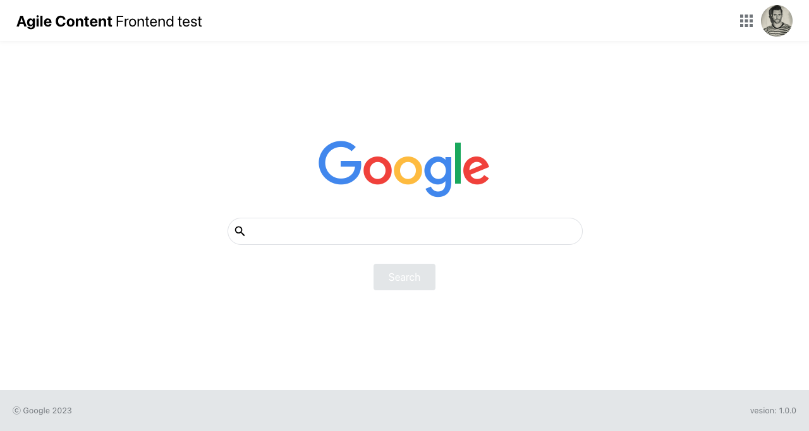
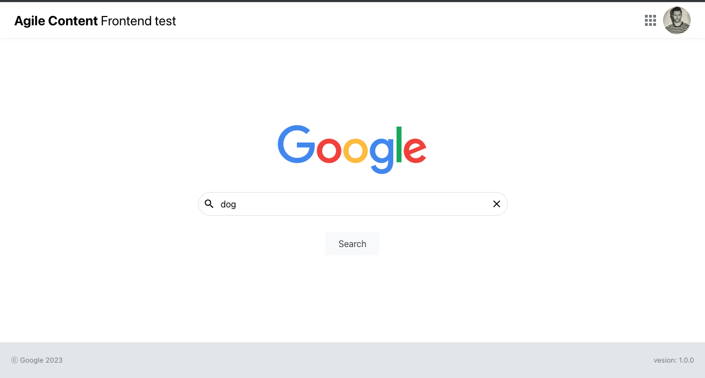
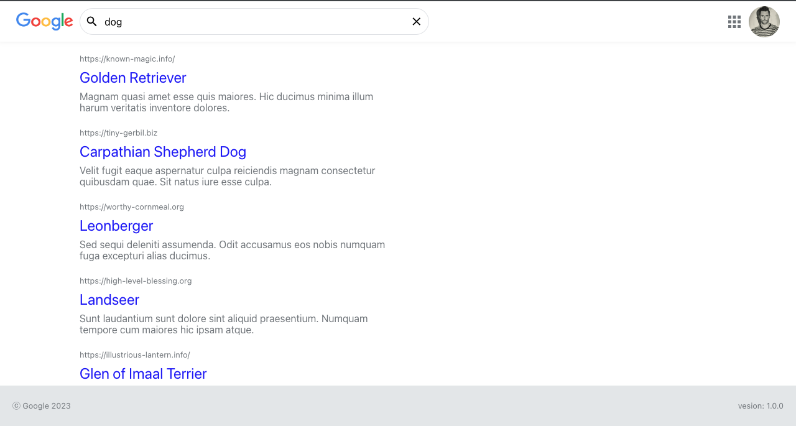
</div>
<div>
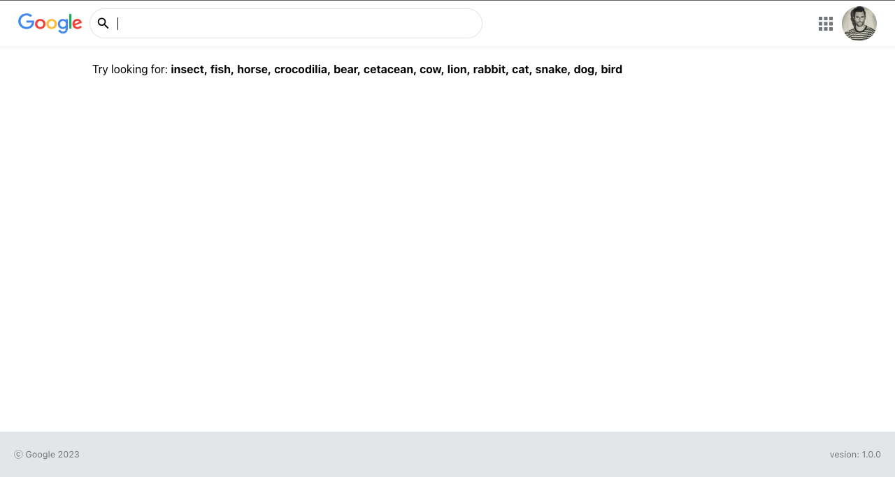
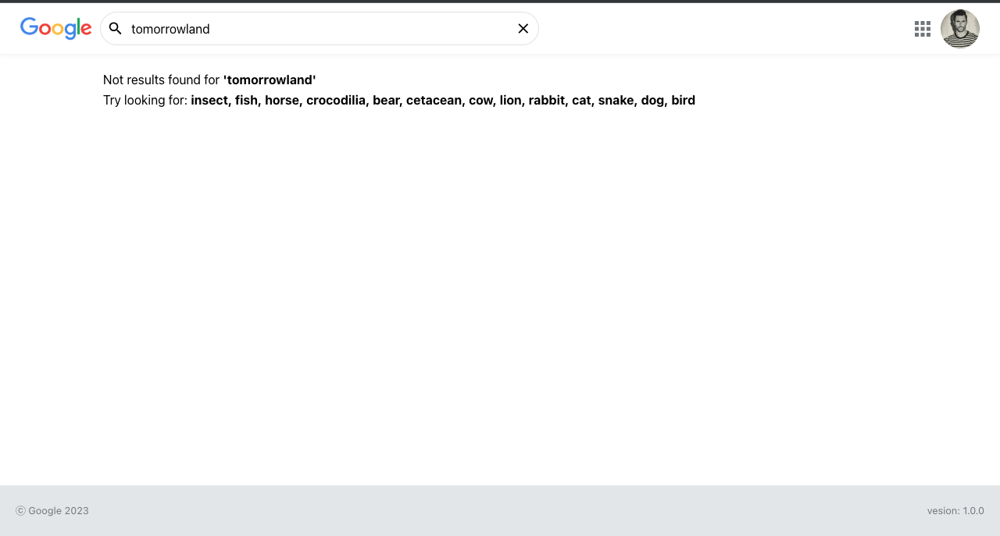
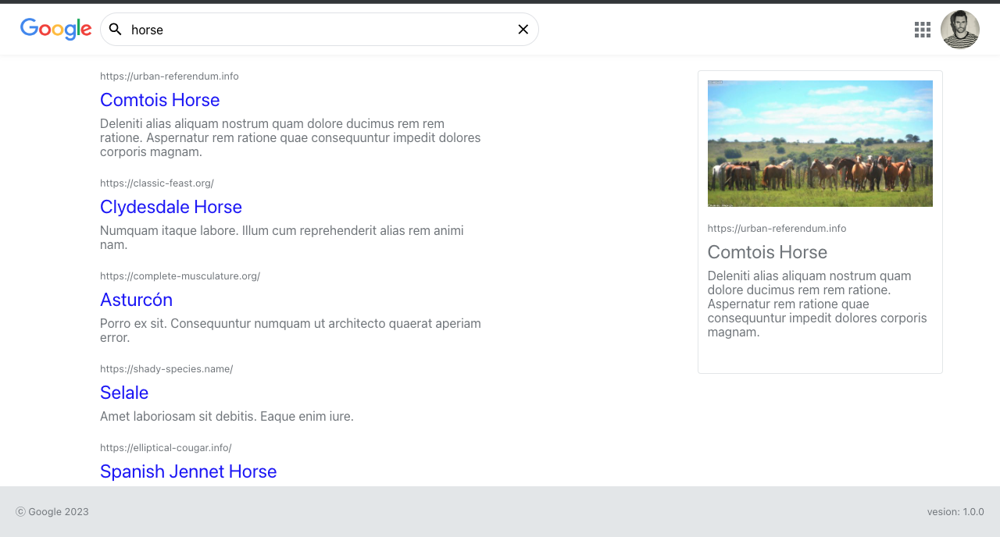
</div>

### Web Responsive Pattern
<div>

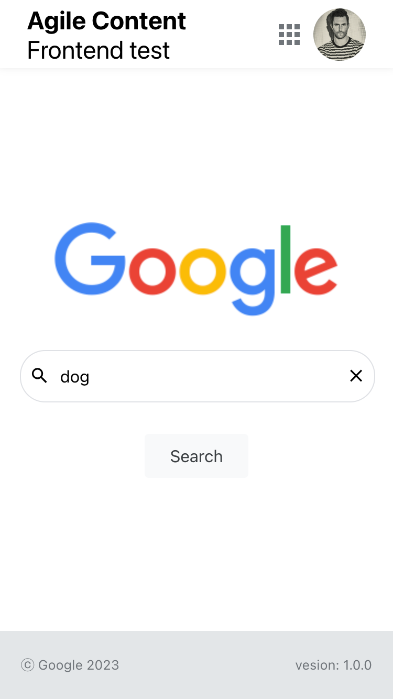
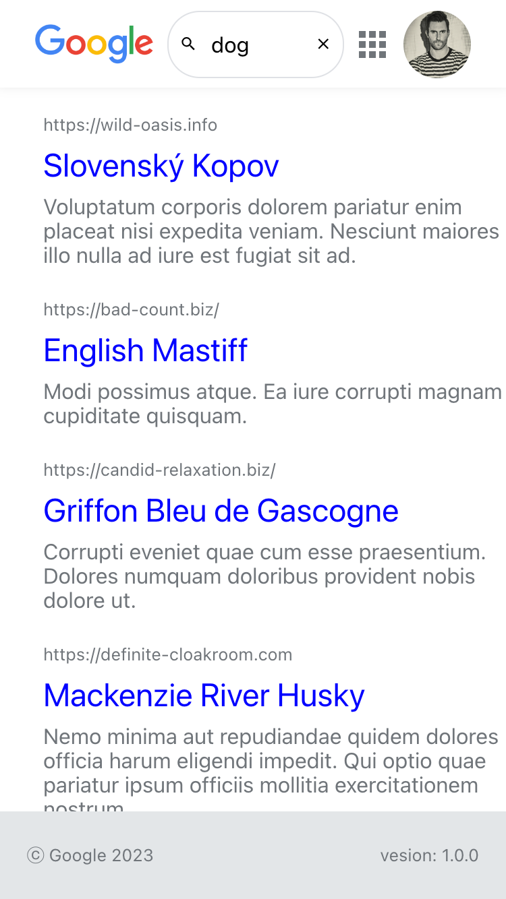
</div>
<div>
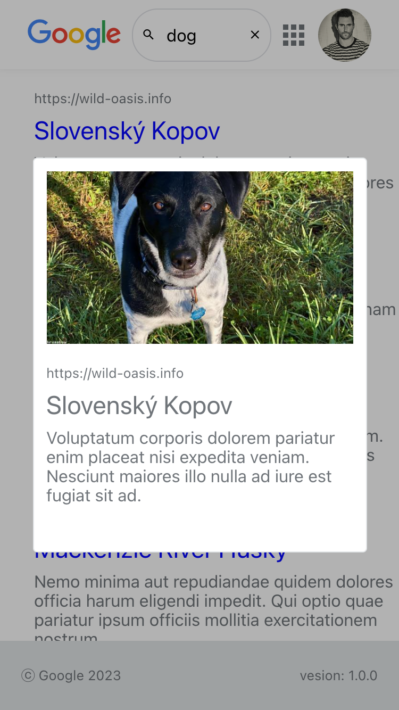
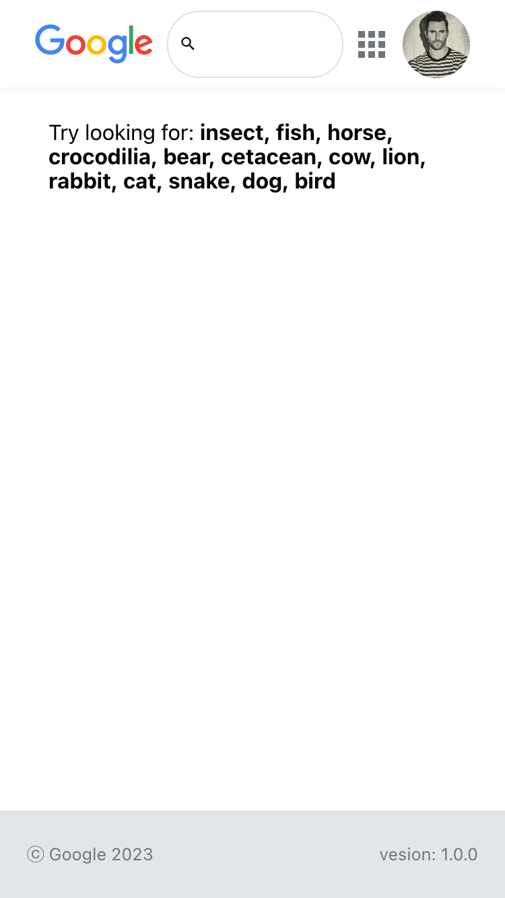
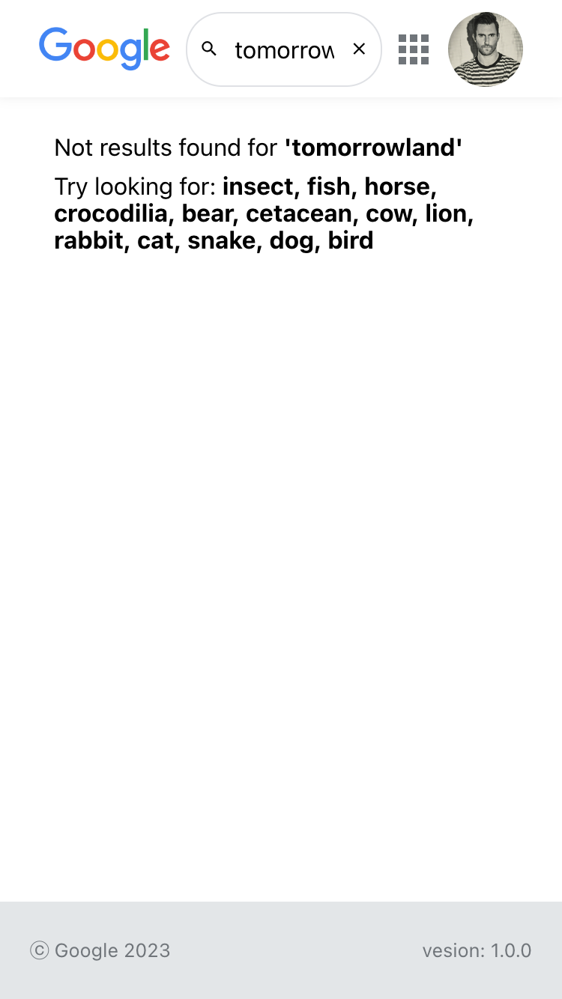
</div>


## License
This project is licensed under the [MIT License](https://opensource.org/licenses/MIT).